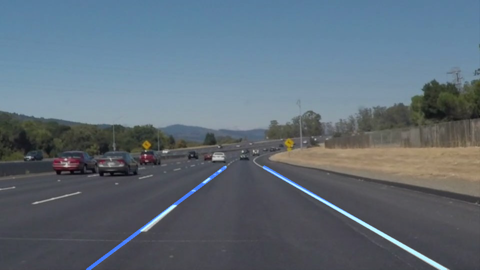

# **Finding Lane Lines on the Road** 

## Term 1 Project 1

### Kevin Chan

---

**Finding Lane Lines on the Road**

The goals / steps of this project are the following:

* Make a pipeline that finds lane lines on the road

* Reflect on your work in a written report

[image1]: ./examples/grayscale.jpg
[image2]: ./test_images_output/edges_solidWhiteCurve.jpg
[image3]: ./test_images_output/linesOnsolidWhiteCurve.jpg
[image4]: ./test_images_output/maskOnsolidWhiteCurve.jpg
[image5]: ./test_images_output/solidWhiteCurve.jpg

---

### Reflection

### 1. Describe your pipeline. As part of the description, explain how you modified the draw_lines() function.

In the pipeline, I had created it just how I learned in class. I would first take an image and then change it into grayscale. 

![grayscale][image1]

After you have converted it into grayscale, I would apply a Gaussian blur in order to blur the rest of the photo to make the lines more distinct when trying to find the lines. 

After you apply the blur, you apply the canny function in order to get the gradient differntial from the photo itself. This lets me draw the lines of the photo more clearly.

![canny][image2]

After I applied the canny function, I would go and apply my mask, xor-ing out any part of the picture that did not matter. I would get a picture that looks like this.

![mask applied][image4]

When I completed the mask, I would use the draw line function to get lines on a blank picture. 

![drawn lines][image3]

However, in part of the project, I am supposed to modify the draw lines function in order to draw two sets of lines, one on the right, and one on the left to make the two lines that I would extrapoleate from the lane lines.

For this, I modified the function by creating my own function that would go in before the `draw_lines()` function. 

I named my function `expol_lines()` that grabs the lines from the Hough function that we had earlier, so it would be backwards compatible if you just take out the `expol_lines()` function from `draw_lines()`.

`expol_lines()` takes all the lines created from the Hough function, and adds all the postive slopes and line segments to two arrays, `rs` and `rc`. It then takes all the negative slopes and centers and puts those in two arrays, `ls`, and `lc`.

I average out all the slopes in each array for two different slopes, and then I average out all the center points to create one center point. Then I use the slope and center point to create an equation of `y - y1 = m (x - x1)`, where `(x1, y1)` is the center point and m is the slope. 

Finally, I would take the points set already for `y`, to find `x` by plugging it into the equation, and I put the values into an array, which I return and plug back into the `draw_lines()` function.

This results in a final picture looking something like this:
![final image][image5]

I later apply this function to videos, and it comes out somewhat nice.

### 2. Identify potential shortcomings with your current pipeline

Some potential shortcomings would include white or lighter colored cars driving into the video. This would distort the image, and not make it possible for my algorithm to detect the lines.

I have faced a shortcoming when I was trying my code on the challenge video. When there is lighter asphalt in the video. My algorithm detects it as part of the lane lines, because far away the light lines contrast with the gray asphalt. This creates a differential gradient that my algorithm does not like, and starts producing wrong lines when it's decoding my video.

Also, changes in position of the video, as well as movement would probably not do so well with my algorithm. If the car hits a bumpy road, and skews the image, it could throw off the entire algorithm. I would have to have video smoothing so that my algorithm can still work.

### 3. Suggest possible improvements to your pipeline

A possible improvement to my pipeline is general smoothing of the lanes during the video. You can see it's calcuating slopes for every frame in the video. I would hope to add something so that it's not constantly calcuating slopes, and it's gradually changing.

Another improvement that I would like to add is better detection of lanes against lighter asphalt. When my algorithm is used against lighter asphalt, it finds the lines aginst the different color of asphalts instead of the lines. I would probably have to apply a higher contrast between the asphalt and make it darker than the lane lines to get my functions to work better.